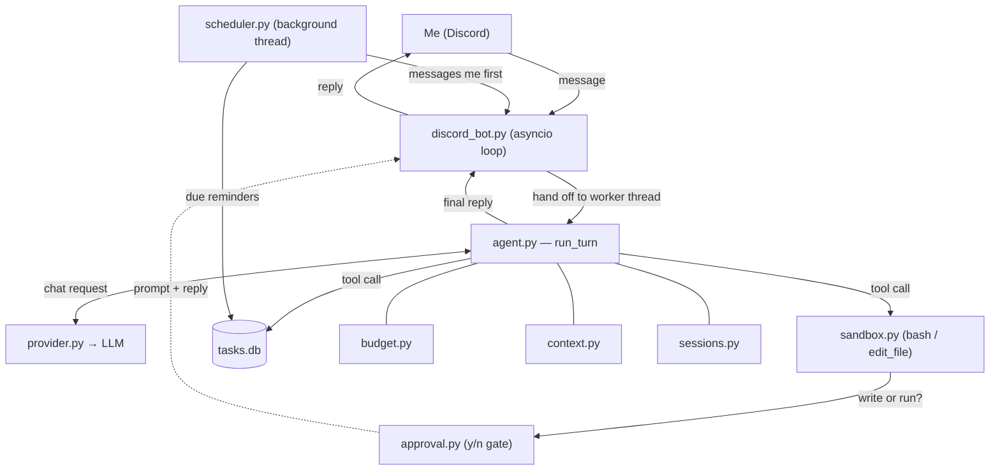

# Personal AI Assistant

A self-hosted AI assistant that lives on my machine, talks to me over Discord, and keeps track of my day — tasks, deadlines, and reminders — while also reading, fixing, and running code in my projects. It's an LLM agent loop with tool use, running on a cheap model under a hard budget cap.

> **Background.** This started as a multi-agent test-writing system for a course assignment. I repurposed it into a general personal assistant: the agent loop, sandbox, budget tracking, and context-management pieces carried over, while the conversational layer, Discord transport, task/reminder system, and persistence were built on top.

---

## What it does

- **Reachable from my phone.** Runs as a Discord bot, so I can talk to it anywhere — the agent itself runs on my own computer.
- **Tracks tasks and deadlines.** Natural language in ("remind me to email Prof. Lind by Friday at 5pm"), stored in SQLite, and queried back ("what's due this week?").
- **Reminds me proactively.** A background scheduler messages me *first* when something comes due — not only when asked.
- **Reads, fixes, and runs code.** Has `bash` and `edit_file` tools scoped to a sandbox directory mounted from the host, so it works on my real projects.
- **Stays cheap.** Defaults to a low-cost model (Claude Haiku via OpenRouter) with a manual ladder up to Sonnet/Opus, plus a hard token budget that stops runaway spend.

## Demo

```
me    could you set that I have a task for 7pm today
bot   What should I call it?
me    it's my raiding session
bot   Done — "raiding session" today at 19:00.

me    what do I have to do today?
bot   You've got the raiding session at 19:00. That's it so far.
```

Later, at 19:00, with no prompt from me:

```
bot   Reminder — raiding session (at 19:00).
```

## Architecture



**The lifecycle of one message:**

1. A Discord message arrives on the asyncio event loop (`discord_bot.py`).
2. Because the agent is blocking, the turn is handed to a worker thread — the loop stays free to receive more messages, including approval answers.
3. The agent loop (`agent.py`) calls the model (`provider.py`), which may request tool calls. Tools run (`sandbox.py` for shell/file work, `tasks.py` for task storage), results feed back, and it loops until the model returns a plain-text reply.
4. The reply goes back to Discord.

Wrapping every turn: a shared **budget** caps spend, **context compaction** keeps the history from overflowing the model's context window, **session persistence** saves history per channel so it survives restarts, and an **approval** gate prompts before any write or code execution. Separately, a **scheduler** thread wakes each minute, checks the task store, and messages me first when something is due.

## Key design decisions

**One-shot → conversational.** The original agent built a fresh message list per task and exited when done. An assistant has to remember across turns, so the history moved onto a `Conversation` object that persists between messages (and to disk). `MAX_ITERATIONS` now bounds a single turn rather than an entire run.

**Bridging async Discord to a blocking agent.** discord.py runs an asyncio event loop, but the agent blocks — on HTTP, on subprocesses, and on waiting for an approval answer. Running a turn directly on the loop would freeze the bot, and worse, deadlock: the turn blocks waiting for a `y/n` that the frozen loop can no longer receive. The fix is to run every turn on a worker thread (`run_in_executor`), leaving the loop free; sends from the worker hop back onto the loop with `run_coroutine_threadsafe`.

**Transport-agnostic approval.** The approval logic — serialize the prompt, wait for `y/n` — is shared, but *how* it prompts and reads the answer is injected per-thread. The terminal reads stdin; Discord posts the prompt as a message and routes the reply back, without touching the core synchronization. One set of logic, two transports.

**Proactive reminders.** Every other message is a reply; a reminder is the bot speaking *first*, with no incoming message to respond to. The scheduler runs off the event loop on its own thread and reaches onto the loop to send, targeting the last channel I used — persisted to disk so reminders still work right after a restart.

**Cost engineering.** It runs a cheap model by default and escalates by hand only when a task needs it ("I am the router" — no fragile difficulty classifier). A hard token cap halts runaway spend, while output truncation and history compaction keep per-call token counts down.

**Layered safety.** Code execution passes through three tiers, in order: a hard-blocked **danger filter** (`rm -rf /`, fork bombs, and similar — never approvable), an auto-approved **read-only allowlist** (`ls`, `cat`, `grep`), and a **human `y/n` prompt** for anything that writes, installs, or runs code. A separate filter scans outgoing messages for leaked credentials.

## Project structure

| File | Role |
|---|---|
| `discord_bot.py` | Discord transport: receives messages, bridges async ↔ threads, runs the scheduler |
| `main.py` | Terminal entry point (an alternative to Discord) |
| `agent.py` | The conversational agent loop and tool dispatch |
| `provider.py` | LLM API client (OpenRouter, OpenAI-compatible) |
| `config.py` / `config.json` | Configuration and tool schemas |
| `system_prompt.md` | The assistant's instructions |
| `sandbox.py` | Sandboxed `bash` / `edit_file` tools with the safety filters |
| `tasks.py` | SQLite task/deadline storage and the scheduler's queries |
| `scheduler.py` | Background reminder loop |
| `budget.py` | Token/rate spend tracking and caps |
| `context.py` | History compaction to stay within the context window |
| `approval.py` | Human-in-the-loop approval, transport-agnostic |
| `console_control.py` | Terminal stdin router (commands / approvals / chat) |
| `sessions.py` | Per-conversation history persistence |
| `secrets_filter.py` | Scans outgoing messages for credential leaks |

## Setup

**1. Install dependencies**

```
python -m venv .venv
.venv\Scripts\activate        # Windows  (source .venv/bin/activate on macOS/Linux)
pip install discord.py requests python-dotenv
```

**2. Add secrets** to a `.env` file one level above the source folder:

```
OPENROUTER_API_KEY=sk-or-...
DISCORD_TOKEN=...
```

**3. Start the sandbox container** with a host folder mounted in, so files the agent creates land on the real machine:

```
docker run -d --name agent-sandbox \
  --mount type=bind,source="<path-to-your>/workspace",target=/workspace \
  python:3.12 sleep infinity
```

**4. Set up the Discord bot** at <https://discord.com/developers>: create an application + bot, enable the **Message Content Intent**, copy the token into `.env`, and invite it to a server.

**5. Run it**

```
python discord_bot.py     # Discord
python main.py            # or use it from the terminal
```

## Limitations & future work

- The current date is stamped when a conversation starts, so a session left running past midnight still thinks it's the previous day (fix: refresh it each turn).
- Reminders fire once; no recurring schedules yet.
- Built for single-user personal use — the bot replies to every message in any channel it can see, so it's meant for a private server or DMs.
- Model escalation is manual; an automatic "escalate when the cheap model gets stuck" path is designed but not yet wired in.